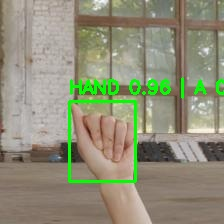
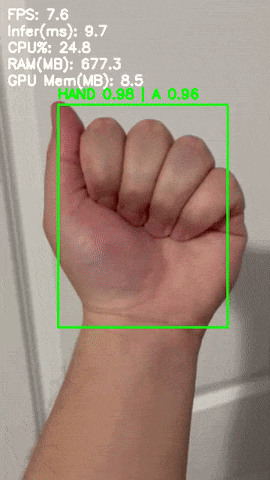

ASL Alphabet Recognition
Real-Time American Sign Language Recognition using Computer Vision and Deep Learning

Course: AI Programming
Author: Faniel Gonzalez
Date: December 18, 2025

📌 Project Overview

This project implements a real-time American Sign Language (ASL) alphabet recognition system using computer vision and deep learning. The system detects a hand, extracts anatomical landmarks, and classifies signed letters with high accuracy while maintaining real-time performance.

The goal is to demonstrate a complete AI pipeline, from dataset preprocessing and training to real-time inference and evaluation.

✨ Key Features

Hand localization using pre-annotated bounding boxes

Hand landmark extraction with MediaPipe Hands

Landmark normalization for scale and translation invariance

Multilayer Perceptron (MLP) classifier

Real-time inference (image, video, webcam)

Confusion matrix and detailed evaluation metrics

GPU acceleration supported (optional)

📂 Dataset

Name: ASL-ObjectDetection Computer Vision Dataset

Source: Roboflow

Format: YOLOv8 (bounding boxes)

Classes Used
A, B, C, D, E, F, G, H, I, J, K, L, M, N, O, P, Q, R

Dropped Classes
S, T, U, V, W, Z

Some letters were removed due to insufficient valid landmark samples after extraction. This filtering ensures stable training and valid stratified evaluation.

🧠 Methodology
Pipeline

Hand Cropping
YOLO bounding boxes are used to crop the hand region from each image/frame.

Landmark Extraction
MediaPipe extracts 21 hand landmarks (XYZ coordinates).

Normalization

Wrist-centered translation

Scale normalization based on maximum hand extent

Classification
A neural network predicts the ASL letter from the normalized landmarks.

🏗 Model Architecture

Input: 63 features (21 landmarks × XYZ)

Hidden Layers:

Dense (256) + ReLU

Dense (256) + ReLU

Output: Softmax over 18 classes

Loss: Cross-entropy

Optimizer: Adam

📊 Results
Classification Performance

Accuracy: 96.96%

Macro F1-score: 96.74%

Weighted F1-score: 96.96%

A confusion matrix is generated to visualize class-level performance.

⚡ Real-Time Performance

Tested using video input on an NVIDIA GPU system:

Metric	Value
FPS	~64
Inference Time	~9.3 ms
CPU Usage	~0%
RAM Usage	~675 MB
GPU Memory	~8.5 MB

The system runs comfortably in real time.

🚀 How to Run
1️⃣ Install dependencies
pip install -r requirements.txt

Note: Python 3.10 or 3.11 is recommended.

2️⃣ Train the model
python train_from_roboflow_yolo.py

This step:

Extracts landmarks

Trains the classifier

Saves the trained model and label maps

3️⃣ Evaluate the model
python eval.py

Outputs:

Precision / Recall / F1 scores

Confusion matrix image

4️⃣ Run the demo
Image
python main.py --mode image --input path/to/image.jpg

Video
python main.py --mode video --input path/to/video.mp4

Webcam
python main.py --mode webcam

## 📸 Demo Preview

### Screenshot

### Demo GIF

📁 Repository Structure
asl-alphabet-recognition/
│
├── main.py
├── train_from_roboflow_yolo.py
├── eval.py
├── hand_detector.py
├── classifier.py
├── utils.py
├── overlay.py
├── metrics.py
│
├── data/
│   ├── label_map_filtered.json
│   └── asl_mlp.pt
│
├── demo_assets/
│   ├── annotated_image.jpg
│   ├── annotated_video.mp4
│   └── confusion_matrix.png
│
├── README.md
├── requirements.txt
└── .gitignore

⚠ Limitations

Only static ASL letters are supported

Single-hand detection only

Dataset imbalance required filtering of some letters

🔮 Future Work

Temporal models (LSTM / Transformers) for motion-based letters

Multi-hand detection

Improved dataset balancing

Depth-based or multi-view features

📎 Acknowledgements

Roboflow for the ASL Object Detection Dataset

MediaPipe for hand landmark extraction

